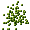

<h1>
Ants
</h1>

<h2>
Ein Informatik-Projekt von Robin Wagner und Finn Westphal
</h2>

<p></p>

<ul>
    <li><a href= "#Einleitung"> 1. Einleitung: Anforderungen und Elemente des Spiels</a></li>
        <ul>
        <li><a href= "#Das Spiel und die Dokumentation"> 1.1 Das Spiel und die Dokumentation</a></li>
        <li><a href= "#Syntax und Funktionsweise von Java"> 1.2 Syntax und Funktionsweise von Java</a></li>
        </ul>
    <li><a href= "#Umsetzung"> 2. Umsetzung</a></li>
        <ul>
        <li><a href= "#Das Szenario"> 2.1 Das Szenario</a></li>
           <ul>
           <li><a href= "#Erstellen einer Welt"> 2.1.1 Erstellen einer Welt</a></li>
           <li><a href= "#Objekte in der Welt"> 2.1.2 Objekte in der Welt</a></li>
           </ul>
        <li><a href= "#Die Creature-Klasse"> 2.2 Die Creature-Klasse</a></li>
           <ul>
           <li><a href= "#Code-Zusammenfassung Die Creature-Klasse"> 2.2.1 Code-Zusammenfassung</a></li>
           </ul>
        <li><a href= "#Die Ants-Klasse"> 2.3 Die Ants-Klasse</a></li>
           <ul>
           <li><a href= "#Code-Zusammenfassung Die Ants-Klasse"> 2.3.1 Code-Zusammenfassung</a></li>
           </ul>
    <li><a href= "#Die AntHill-Klasse"> 2.4 Die AntHill-Klasse</a></li>
    <li><a href= "#Die Food-Klasse"> 2.5 Die Food-Klasse</a></li>
    </ul>
    <li><a href= "#Stundenübersicht"> 3. Stundenübersicht</a></li>
<li><a href= "#Quellen"> 4. Quellen</a></li>
</ul>

<h2>
<a id="Einleitung">1. Einleitung</a>
</h2>

Ants ist ein biologisch faszinierendes Greenfoot-Projekt. Ameisen kommen aus Ameisenhügeln nach und nach heraus und suchen nach Futterhaufen. Wenn sie Futter gefunden haben, essen sie ein paar Krümel vom ganzen Futterhaufen und kehren zurück zu ihrem Zuhause, dem Ameisenhügel. Wenn die Ameisen Futter gefunden haben hinterlassen sie Spuren (Pheromone) auf ihrem Heimweg, die andere Ameisen erkennen und denen sie folgen. Ansonsten bewegen sich die Ameisen recht naturecht mit unterschiedlicher Geschwindigkeit und können oft ihre Ausrichtung ändern. 

<p></p>


<p>		
In den folgenden Ausführungen werden wir schrittweise beschreiben, wie wir bei der Programmierung des Spiels vorgegangen sind. Es macht Sinn, sich in der angegeben Reihenfolge mit dem Dokument zu beschäftigen, um unsere Gedankengänge nachzuvollziehen. Dies gilt vor allem für die verwendeten Programmiermethoden und Befehle, die wir nicht in jedem Kapitel neu erläutern, sondern nur beim ersten Auftreten detailliert beschreiben und als Wissensgrundlage für weitere Anwendungsfälle vorraussetzen.
</p>

<h3>
<a id="Syxtax und Funktionsweise von Java"> 1.2 Syntax und Funktionsweise von Java</a>
</h3>

<p>
Die Programmierumgebung <i>Greenfoot</i> basiert auf der objektorientierten Blockprogrammiersprache <i>Java</i>. Ziel dieser Umgebung ist es, mit relativ einfachen Mitteln und ohne Vorkenntnisse objektorientierte Simulationskonzepte zu programmieren. Für das bessere Verständnis erklären wir kurz den generellen Aufbau und die Syntax von <i>Java</i>.		
</p>		
 		
<p>		
Java ist aus Blöcken aufgebaut, die im Syntax durch geschweifte Klammern gekennzeichnet werden. Der Inhalt dieser Blöcke kann Anweisungen und Befehle, aber auch weitere Blöcke enthalten. Auf diese Weise ist eine verschachtelte Blockstruktur mit mehreren Ebenen möglich. Der Vorteil einer Block-Programmierung ist, dass Syntax-Fehler leichter indentifiziert werden können, da nur einzelne Blöcke nicht ordnungsgemäß funktionieren und nicht der gesamte Code defekt ist.		
</p>		
 		
```javascript
Anweisung
{
    Anweisung
    {
    	Anweisung
    }
}
```

Wir programmieren unser Projekt "Ants" in der Programmierumgebung "Greenfoot", die auf der objektorientierten Programmiersprache Java basiert. Zunächst haben wir festgelegt, welche Größe, welches Format und welche Auflösung unsere Welt haben soll. Unser Spiel soll über eine klassische Auflösung und ein klassisches Seitenverhälnis verfügen, damit es auf jedem Computer spielbar ist. Wir haben uns deswegen für das Seitenverhältis von 1/1 und eine Auflösung von 640 * 640 Pixeln entschieden. Diese Bildeigenschaften sind von den meisten aktuellen Displays umsetzbar.

<h2>
<a id="Umsetzung"> 2. Umsetzung</a>
</h2>

<h3>
<a id= "Das Szenario"> 2.1 Das Szenario</a>
</h3>


2.1.1 Erstellen einer Welt

Mit dem Konstruktor public erstellen wir eine Welt-Klasse namens space_backround_1 und durch die Methode import greenfoot.*; geben wir an, dass diese Klasse in das Szenario implementiert werden soll. Fehlt diese Methode oder wird sie verändert, so würde diese Klasse beim Start des Programmes nicht geladen werden. Hinter jeder Klasse stehen mindestens eine geöffnete und eine geschlossene Klammer, die zusätzliche Parameter enthalten können. Zur Ausführung der Methoden, die wir verwenden, sind keine weiteren Parameter notwendig, weswegen bei uns nichts zwischen den Klammern steht. Die Referenz super sorgt dafür, dass alle Eigenschaften der Super- oder Hauptklasse auf alle anderen Klassen übertragen werden. In diesem Fall ist die Super-Klasse die generierte Welt. Diese Anweisung benötigt weitere Parameter für ihre Funktionalität und zwar die Auflösung der generierten Welt und das Verhältnis zwischen Pixeln und Zellen des Zellen-Koordinatensystems, das deckungsgleich zur generierten Welt erstellt wird. Wir wollen dieses Verhältnis auf 1:1 festlegen, sodass eine Zelle einem Pixel entspricht. Um diese Parameter dem Konstruktor zur Verfügung zu stellen, schreiben wir nach super in Klammern (640, 640, 1, true). Der erste Parameter definiert die Anzahl der Pixel entlang der x-Achse, der zweite nach dem Komma die Pixelanzahl in y-Richtung und der dritte Parameter "1" sagt aus, dass eine Zelle die Größe von einem Pixel in x- und y- Richtung besitzt. Das Größenverhältnis zwischen Zellen und Pixeln beträgt also 1:1. Wir haben aber nicht die Koordinaten 640 benutzt, sondern eine feste Größe der Welt (WORLDSIZE) auf 640 festgelegt, die wir später weiter verwendet haben. Durch den Parameter true erreichen wir, dass die Asteroiden und auch die Rakete zunächst nicht aus der Welt verschwinden können, da die Grenzen der Welt für sie eine Barriere darstellen. 
In dieser Zeile steht ein Semikolon, das verschiedene Methoden voneinander trennt. 
Ein Hintergrund der Welt war durch das Downloaden von Greenfoot Ants Project auf der Greenfoot Website schon vorgegeben und passt zum Ameisen-Szenario, sodass wir diesen nicht verändern mussten. Durch setPaintOrder können wir die Farbgebungsaufträge der Welt und der Ants Klasse aufnehmen. Außerdem erstellen wir mit scenario 1() ein neues Szenario für die Welt, in welchem die Objekte zu Beginn hinzugefügt werden.

```javascript

import greenfoot.*;

public static final int WORLDSIZE = 640;
    {
     public AntWorld()
    {
        super(WORLDSIZE, WORLDSIZE, 1,false);
        setPaintOrder(AntWorld.class, Ant.class);
        scenario1();
    }
    }
```

<p></p>

2.1.2 Objekte in der Welt

Bisher enthält unsere Welt noch keine Objekte, die agieren können und für unser Spiel relevant sind. Wir benötigen in jedem Fall zunächst eine Creature, Ants, AntHill, Pheromon und Food-Klasse. Da die Ameisen immer aus ihrem Ameisenhügel spawnen sollen, legen wir die Koordinaten der Ameisenhügel mithilfe des Befehls addObject fest. Die Methode addObject benötigt bestimmte Parameter für ihre Funktionalität. Zu diesen zählt zum Einen die Bezeichnung des zu generierenden Objektes einer Klasse und seine Position in der Welt. Hierzu wird nach addObject in Klammern die jeweilige Klasse mit dem Aufdruck new davor genannt, welcher als Referenz festlegt, dass ein Objekt dieser Klasse hinzugefügt werden soll. Schließlich geben zwei Parameter, durch Kommata getrennt, die Koordinaten des jeweiligen Objekts an. Diese Koordinaten haben wir so gewählt, dass die Ameisenhügel jeweils ein bisschen auseinander liegen. Außerdem sollen zu Beginn Futterhaufen für die Ameisen vorhanden sein. Diese haben wir so gewählt, dass sie etwas auseinander und auf der ganzen Karte verteilt liegen. Es sollten außerdem nicht zu wenige Futterhaufen sein, da die Ameisen diese sonst zu schnell leeren.

```javascript

import greenfoot.*;
public void scenario1()
    {
        addObject(new AntHill(), WORLDSIZE / 2, WORLDSIZE / 2);
        addObject(new AntHill(), WORLDSIZE / 4, WORLDSIZE / 4);
        addObject(new Food(), 200, 200);
        addObject(new Food(), 50, 50);
        addObject(new Food(), 300, 50);
        addObject(new Food(), 500, 200);
        addObject(new Food(), 300, 275);
        addObject(new Food(), 300, 350);
        addObject(new Food(), 350, 400);
        addObject(new Food(), 150, 400);
        addObject(new Food(), 400, 550);
        addObject(new Food(), 550, 500);
    }
```

<p>
Zusammengefasst ergibt sich für die World-Klasse:
</p>


```javascript
import greenfoot.*;

public static final int WORLDSIZE = 640;
public AntWorld()
    {
        super(WORLDSIZE, WORLDSIZE, 1,false);
        setPaintOrder(AntWorld.class, Ant.class);
        scenario1();
    }
    public void scenario1()
    {
        addObject(new AntHill(), WORLDSIZE / 2, WORLDSIZE / 2);
        addObject(new AntHill(), WORLDSIZE / 4, WORLDSIZE / 4);
        addObject(new Food(), 200, 200);
        addObject(new Food(), 50, 50);
        addObject(new Food(), 300, 50);
        addObject(new Food(), 500, 200);
        addObject(new Food(), 300, 275);
        addObject(new Food(), 300, 350);
        addObject(new Food(), 350, 400);
        addObject(new Food(), 150, 400);
        addObject(new Food(), 400, 550);
        addObject(new Food(), 550, 500);
        }
       
```
 
 <h3>
<a id= "Die Creature-Klasse"> 2.2 Die Creature-Klasse</a>
</h3>

<h4>
<a id="Code-Zusammenfassung Die Creature-Klasse"> 2.2.1 Code-Zusammenfassung</a>
</h4>

<h3>
<a id= "Die Ants-Klasse"> 2.3 Die Ants-Klasse</a>
</h3>

<p></p>

<p></p>

<h4>
<a id="Code-Zusammenfassung Die Ants-Klasse"> 2.3.1 Code-Zusammenfassung</a>
</h4>

<h3>
<a id= "Die AntHill-Klasse"> 2.4 Die AntHill-Klasse</a>
</h3>

<p></p>

<h3>
<a id= "Die Food-Klasse"> 2.5 Die Food-Klasse</a>
</h3>

<p></p>

<h3>
<a id= "Stundenübersicht"> 3. Stundenübersicht</a>
</h3>

<h4>
Donnerstag, den 23.02.2017:
</h4>

An diesem Tag haben wir nach der 2.Abgabe das Spiel SpaceRocket abgeschlossen und haben festgestellt, dass wir in Zukunft gerne ein neues Projekt für den letzten verbleibenden Monat beginnen möchten, welches am besten nicht zu umfangreich ist, damit es auch in ca. 3 Wochen zu schaffen ist.

<h4>
Mittwoch, den 01.03.2017:
</h4>

Wir haben erste Ideen entwickelt und haben uns durch das Greenfootbuch von Michael Kölling, vor allem Kapitel 9, inspirieren lassen. Wir mussten uns zwischen dem Ameisenprojekt und einem Projekt namens Boids, welches das Schwarmverhalten von Vögeln simuliert, entscheiden. Dazu haben wir uns im Greenfootbuch die notwendigen Seiten durchgelesen und uns anschließend wir das aus unserer Sicht biologisch und programmiertechnisch ansprechendere, aber gleichzeitig nicht zu zeitaufwendige Ameisen-Projekt entschieden.

<h4>
Donnerstag, den 02.03.2017:
</h4>

Zu Beginn haben wir erst einmal das Projekt Greenfoot Ants Project von der Greenfoot Website heruntergeladen.
Die übrige Zeit haben wir genutzt, um zunächst das Projekt zu verstehen: Die Ameisen spawnen immer nur aus zwei bestimmten Ameisenhaufen, die sich immer an den gleichen Stellen befinden. Sie bewegen sich auf der Suche nach Futter zufällig und können rotieren. Wenn sie Futter gefunden haben, sollen sie ein paar Krümel essen, die Farbe verändern und auf dem Weg zu ihrem Zuhause, dem Ameisenhügel, Pheromone ausstoßen, die andere Ameisen wahrnehmen und den Pheromonen schließlich folgen. Dies hörte sich erst einmal ziemlich kompliziert an. Wir versuchten, erst einmal die Welt-Klasse Antworld zu verstehen und haben zusätzlich zu zwei Ameisenhaufen noch 10 Plätze für das Futter auf verschiedenen Punkten der Welt hinzugefügt.

<h4>
Mittwoch, den 08.03.2017:
</h4>

Am Mittwoch haben wir uns mit der recht komplizierten Creature Klasse vertraut gemacht und angefangen, den Code zu vereinfachen bzw. so umzuschreiben, dass er einfacher und verständlicher wird.

<h4>
Donnerstag, den 09.03.2017:
</h4>

Wir haben das Programmieren der Creature Klasse abgeschlossen und angefangen, die von der Creature Klasse abhängige Ameisen (Ant) Klasse zu programmieren. Dazu haben wir zunächst...

<h4>
Samstag, den 11.03.2017:
</h4>

Nachdem wir mit der Creature und der Ant Klasse schon zwei Klassen zuende programmiert hatten, haben wir begonnen, die Dokumentation anzufertigen. Dazu haben wir in Github ein neues repository erstellt und zunächst ein Inhaltsverzeichnis mit den wichtigen Punkten angefertigt. Anschließend haben wir eine Einleitung geschrieben, die das Ants Projekt darstellt, und die Syntax und Funktionsweise von Java genauer erklärt. Auch die Welt als Klasse mit ihren Befehlen haben wir erklärt.

<h4>
Dienstag, den 14.03.2017:
</h4>

Am Dienstag haben wir dann die einzelnen Klassen ins Inhaltsverzeichnis hinzugefügt und mithilfe von Github Desktop, was wir vorher downloaden mussten, die einzelnen Bilder der Klassen hinzugefügt, indem wir vorher einen Ordner images mit allen Bildern drin erstellt hatten.

<h4>
Donnerstag, den 16.03.2017:
</h4>

Die Doppelstunde haben wir genutzt, um die Food-Klasse zu programmieren. Dabei haben wir uns zunächst die Seite im Greenfoot Buch genau durchgelesen und sind nach den Aufgaben des Buches vorgegangen. Uns war wichtig, dass das Futter aus vielen einzelnen Krümeln besteht und normalverteilt ist, da das Futter sonst unecht erscheinen würde.

<h4>
Sonntag, den 19.03.2017:
</h4>

Bisher können die Ameisen das Futter aufnehmen und dann ihre Farbe verändern, aber nicht zu ihrem Zuhause, dem Ameisenhaufen, zurückkehren. Dieses Problem haben wir am Wochenende gelöst und konnten dann auch zwei Screenshots, einen beim Start und einem mitten im Spiel, aufnehmen und in die Dokumentation einfügen.

<h4>
Dienstag, den 21.03.2017:
</h4>

Wir haben die Zeit genutzt, um eine Github-Pages Datei zu erstellen und anschließend unser Projekt auf Github Pages hochzuladen und einen bestimmten Hintergrund auszuwählen. Dazu war es auch notwendig, die Codes dementsprechend zu fragmentieren.

<h4>
Mittwoch, den 22.03.2017:
</h4>

Zwar funktionierte das Projekt ganz gut, jedoch hatten wir immernoch ein Problem: Die Ameisen sind, wenn sie Futter gefunden haben und zum Ameisenhaufen zurückgekehrt sind, nicht erneut auf Futtersuche gegangen, aber eigentlich sollten sie wie in einem Kreislauf immer wieder bewegen. Dieses Problem haben wir behoben und somit hat die Ameisen alle Funktionen erfüllt.

<h4>
Donnerstag, den 23.03.2017: 
</h4>

Bei unserem Projekt sind wir schon recht weit gekommen. Das Szenario funktioniert recht gut und sieht auch realistisch aus. Bei der Dokumentation jedoch fehlten noch große Teile. Also haben wir die Ameisenklasse zuende erklärt und auch die Food Klasse erläutert. Und auch der Zeitplan existierte nur in Stichpunkten, sodass wir diesen noch ausformulieren mussten. Zuhause haben wir die Dokumentation dann fertiggestellt. Leider haben wir es in der Zeit nicht geschafft, noch eine Pheromonen Klasse hinzuzufügen, wodurch Ameisen, die Futter gefangen hätten, Pheromone ausstoßen würden, wodurch andere Ameisen dann die Pheromone befolgen würden und damit ebenfalls an Futter gelangen. Dazu war die Zeit von knappen drei Wochen zu kurz. Außerdem hätten wir bei mehr Zeit gerne noch zwei Scores hinzugefügt, einen bei jedem Ameisenhügel, der die antreffenden grünen Ameisen (mit Futterkrümeln) beim Ameisenhaufen gezählt hätte. Dann hätte man sehen können, bei welchem der beiden Hügel mehr Ameisen anzutreffen sind. Zusätzlich wäre auch ein Gave-Over Schild schön gewesen, wenn alle Futterhaufen leer sind. Dazu war die Zeit allerdings zu knapp.


<h3>
<a id= "Quellen"> 4. Quellen</a>
</h3>

- Michael Kölling: *Einführung in Java mit Greenfoot*. Pearson Education Deutschland GmbH, 2010
- Download: Greenfoot AntsProject
